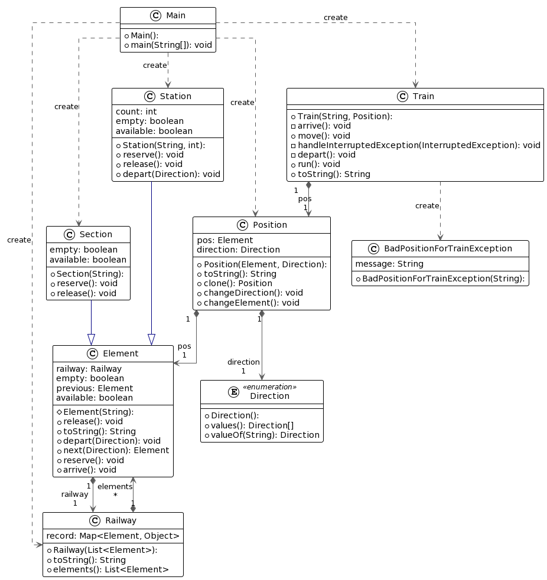

# TP Train (TP 11 - 15)
_Groupe composé de FOURANE Badr, DAHECH Mohammed Amine._

## Introduction
Ce projet s'inscrit dans le cadre du cours sur les logiciels concurrents. Il consiste en la modélisation en Java du déplacement de trains sur des rails.
- Éditeur utilisé : `IntelliJ IDEA`

## Diagramme de classes final : 


## Observations et remarques :
- À part les commentaires fournis avec le code initial, nous avons choisi de commenter le code en Anglais, de même pour le choix des noms des variables et méthodes.
- Nous avons changé quelques parties du code initial, plusieurs attributs de classes qui étaient finals ne le sont plus, nous avons de plus opter pour l'utilisation de List au lieu de Array comme Data Structure à travers le code pour sa compatibilité avec nos besoins.
- Même si les consignes du TP nous fournissent des clés de solutions pour répondre aux problèmes confrontés au cours du développement du projet, nous avons des fois choisi de les ignorer et développer nos propres solutions.
- Nous avons trouvé que les consignes fournies au cours du TP étaient des fois difficile à comprendre et rendent à la confusion dans notre cas. Néanmoins, nous avons essayé d'être aussi fidèle que possible aux attentes de l'évaluateur.  

## Réponses aux questions

### Roles des classes :

- **Direction :** Énumération représentant la direction du mouvement sur le chemin de fer (Railway), soit LR "de gauche à droite" ou RL "de droite à gauche".

- **Element :** Classe abstraite représentant un élément générique dans le système ferroviaire (Railway), tel qu'une section ou une station. Gère l'élément précédent, fournit des méthodes pour vérifier la disponibilité, la réservation, la libération et le mouvement.

- **Position :** Représente la position d'un train, comprenant l'élément actuel et la direction. Peut changer de direction et d'élément, et fournit une représentation sous forme de chaîne pour un affichage facile.

- **Railway :** Gère une liste d'éléments pour représenter l'ensemble du système ferroviaire. Initialise les éléments et les enregistrements, fournit une représentation sous forme de chaîne du chemin de fer.

- **Section :** Sous-classe concrète d'`Element` représentant une section du chemin de fer. Implémente des méthodes pour la disponibilité, la réservation et la libération.

- **Station :** Sous-classe concrète d'`Element` représentant une station sur le chemin de fer. Gère la taille et le nombre d'éléments, implémente des méthodes pour la disponibilité, la réservation et la libération.

- **Train :** Implémente l'interface `Runnable`, représentant un train qui se déplace le long du chemin de fer. Peut partir, se déplacer et arriver, avec des méthodes pour gérer les interruptions et fournir une représentation sous forme de chaîne.

- **BadPositionForTrainException :** Classe d'exception personnalisée jetée lorsqu'un train est initialisé avec une position invalide.

- **Main :** La classe principale où le système ferroviaire est mis en place. Crée des instances de stations, de sections et de trains, initialise le chemin de fer et lance des threads pour les trains.


### Question 2.2 : Identifiez les variables qui permettent d’exprimer l’invariant de sûreté pour la ligne de trains.
- `Railway.elements` : La liste d'éléments qui représente la ligne de trains.
- `Element.previous` : La référence à l'élément précédent dans la ligne.
- `Element.railway` : La référence au chemin de fer auquel l'élément appartient.
- `Section.full` : Un indicateur de la disponibilité d'une section (si elle est occupée par un train ou non).
- `Station.size` et `Station.count` : Le nombre de quais dans une station et le nombre actuel de trains dans cette station.

### Question 2.3 : À l’aide des variables identifiées, exprimez l’invariant de sûreté.
- **Invariant de Sûreté :**
    - Le nombre de trains maximum dans une gare (Station) est égal au nombre de quais de la gare.
    - Dans une section, il y a au maximum un train.

### Question 2.4 : Quelles sont les actions « critiques » que peut effectuer un train ?
Les actions critiques que peut effectuer un train et qui modifient l'invariant de sûreté sont principalement les méthodes associées à la gestion des mouvements, de la réservation, et de la libération des éléments de la ligne (Station, Section, etc.). Ces méthodes sont liées à la classe `Element`.

### Question 2.5 : Dans quelles classes ces actions doivent être ajoutées ?
Les actions critiques, c'est-à-dire les méthodes qui modifient l'invariant de sûreté, doivent être ajoutées dans la classe `Element` (et ses sous-classes comme `Station` et `Section`). Ces méthodes devraient être marquées comme `synchronized` pour assurer l'exclusion mutuelle et éviter les problèmes de concurrence lorsqu'elles sont exécutées par différents threads.

### Question 2.6 : Selon la méthode de construction d’une solution de synchronisation donnée plus haut, quelles autres méthodes faut-il ajouter et dans quelle classe ?**
1. **Méthodes de Réservation et Libération :**
    - Ces méthodes devraient être marquées comme `synchronized` pour assurer l'exclusion mutuelle pendant la réservation et la libération d'une section ou d'une station.
    - Exemples :
      ```java
      public synchronized void reserve() {
          // Logique de réservation
      }
 
      public synchronized void release() {
          // Logique de libération
      }
      

2. **Méthodes de Mouvement (Départ et Arrivée) :**
    - Ces méthodes devraient également être marquées comme `synchronized` pour éviter que plusieurs trains ne se déplacent simultanément et pour respecter l'invariant de sûreté.
    - Exemples :
      ```java
      public synchronized void depart(Direction dir) throws InterruptedException {
          // Logique de départ
      }
 
      public synchronized void arrive() {
          // Logique d'arrivée
      }
      

3. **Méthodes de Vérification d'État (isAvailable, isEmpty, etc.) :**
    - Ces méthodes devraient être utilisées pour évaluer les conditions d'attente lors de la synchronisation.
    - Exemples :
      ```java
      public synchronized boolean isAvailable() {
          // Logique de vérification de disponibilité
      }
 
      public synchronized boolean isEmpty() {
          // Logique de vérification d'absence de train
      }
      

4. **Méthodes de Changement d'État (changeDirection, changeElement, etc.) :**
    - Ces méthodes sont implémentées au niveau de la classe Position
    - Exemples :
      ```java
      public synchronized void changeDirection() {
          // Logique de changement de direction
      }
 
      public synchronized void changeElement() {
          // Logique de changement d'élément
      }


### Exercice 3 : 
Cet exercice traite le deadlock déclenché au cas où deux trains sont l'un devant l'autre ayant des directions opposés et chacun attend que l'autre vide sa section.  
Pour traiter ce problème, nous avons décidé d'ajouter une HashMap au niveau de la classe Railway ayant comme clés les éléments du Railway et comme valeurs respectives soit la direction d'un train dans le cas où un train est dans la section ou null dans le cas contraire.  
De cette façon, quand un train veut faire son départ d'une station, il verifie l'existence de trains allant dans le sens opposé jusqu'à le prochain train en accedant directement à la HashMap au niveau du Railway.

### Question 3.2 : À l’aide des nouvelles variables, identifiez la nouvelle condition pour l’invariant de sûreté.

La nouvelle condition pour l'invariant de sûreté peut être exprimée comme suit :

- **Nouvel Invariant de Sûreté :**
   - Un train ne peut quitter une gare que si aucune autre train n'est présent jusqu'à la prochaine station dans le sens opposé.

